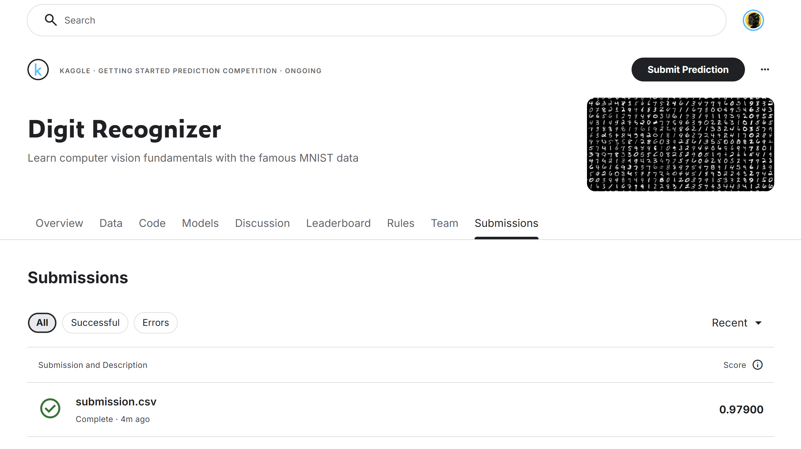

# Распознавание рукописных цифр MNIST: гистограммы градиентов и метод опорных векторов

Домашняя работа по программе Нетологии «Machine learning», модуль «Компьютерное зрение»,
занятие 3 «Сегментация и детекция объектов». Автор - Евгения Вострецова.

## Что здесь

- `Распознавание_цифр_MNIST_(Вострецова_Евгения).ipynb` - работа целиком,
  с уже посчитанными выводами и графиками. Повторный запуск не требуется.
- `kaggle_результат.png` - скриншот результата на Kaggle.

## Данные

Контест [Digit Recognizer](https://www.kaggle.com/c/digit-recognizer) на Kaggle:
42 000 размеченных картинок 28x28 в оттенках серого и 28 000 тестовых без меток.
Метки теста есть только у Kaggle, качество на нем считается после отправки файла
с предсказаниями.

Файлы `train.csv` и `test.csv` в репозиторий не положены: правила соревнования
не разрешают распространять его данные. Скачать их можно на странице контеста
после входа и согласия с правилами.

## Что сделано

Каждая картинка переведена в **гистограммы направленных градиентов (HOG)**: клетка 7x7
пикселей, 9 направлений, нормировка по блокам 2x2 клетки. Вместо 784 пикселей
получается вектор из 324 признаков.

Классификатор выбирался по accuracy на отложенной пятой части обучающей выборки
(8 400 картинок, разбиение со стратификацией по цифре). Все модели с параметрами
по умолчанию:

| Модель | accuracy | ошибок из 8 400 |
|---|---|---|
| **SVC, ядро rbf** | **0.9810** | **160** |
| k ближайших соседей | 0.9670 | 277 |
| логистическая регрессия | 0.9639 | 303 |
| ближайший центроид | 0.8989 | 849 |

Две лучшие модели сравнены парно на одних и тех же картинках: из 219, где они
разошлись, права SVC в 168, kNN в 51 (точный критерий Макнемара, p-value порядка 1e-15).

Самые частые ошибки связаны с девяткой: 4 -> 9 (12 раз), 7 -> 9 и 9 -> 7 (по 9),
8 -> 9 (8 раз).
Для отправки SVC переобучена на всех 42 000 картинках.

## Результат на Kaggle

Accuracy на тесте - **0.979** при пороге задания 0.6.



## Как запустить

Python 3.12, пакеты `pandas`, `numpy`, `matplotlib`, `seaborn`, `scipy`,
`scikit-learn`, `scikit-image`.

Положить `train.csv` и `test.csv` с Kaggle рядом с ноутбуком и запускать из этой папки.
Полный прогон занимает около четырех минут, почти все время уходит на SVC.

```
jupyter notebook "Распознавание_цифр_MNIST_(Вострецова_Евгения).ipynb"
```
